  
  

  👨‍🎓 Core student at:
  
     
  🧑‍💻 Languages:
  
  
  
  
  
  
     
  💻 Editors:
  
  
  
  
     
  🤖 AI tools:
  
  
  
     
  🕹️ Game dev:
  
  
     
  🖥️ OS:
  
  
  
  
  
  
     
  ⌨️ Shells:
  
  
     
  📷 Photography:
  
  
  
  
  
     
  🎥 Video:
  
  
  
  
     
  🎤 Audio:
  
  
  
  
     
  🧊 3D:
  
  

   
  

<pre>
__| |________________________________________________________________________________________________________| |__
__   ________________________________________________________________________________________________________   __
  | |                                                                                                        | |  
  | |                                                                                                        | |  
  | |     :::       ::: :::    ::: :::::::::::   :::   :::   ::::::::: ::::::::::: :::    ::: ::::::::  :::  | |  
  | |    :+:       :+: :+:    :+:     :+:      :+:+: :+:+:       :+:      :+:     :+:   :+: :+:    :+: :+:   | |  
  | |   +:+       +:+ +:+    +:+     +:+     +:+ +:+:+ +:+     +:+       +:+     +:+  +:+  +:+    +:+ +:+    | |  
  | |  +#+  +:+  +#+ +#++:++#++     +#+     +#+  +:+  +#+    +#+        +#+     +#++:++   +#+    +:+ +#+     | |  
  | | +#+ +#+#+ +#+ +#+    +#+     +#+     +#+       +#+   +#+         +#+     +#+  +#+  +#+    +#+ +#+      | |  
  | | #+#+# #+#+#  #+#    #+#     #+#     #+#       #+#  #+#          #+#     #+#   #+# #+#    #+# #+#       | |  
  | | ###   ###   ###    ### ########### ###       ### ######### ########### ###    ### ########  ########## | |  
  | |                                                                                                        | |  
__| |________________________________________________________________________________________________________| |__
__   ________________________________________________________________________________________________________   __
  | |                                                                                                        | |  
</pre>
<pre>
whimzikol @ github
----------------------
- 🎓 I am a core student at 42 Berlin
- 🌱 Currently learning: C
- 🕺 Fun fact: I dance salsa
</pre>
  

  <table style="border-collapse: collapse; border=none;">
    <tr>
      <td style="border: none; padding: 0;">
          
      </td>
      <td style="border: none; padding: 0;">
          
      </td>
    </tr>
  </table>

  

